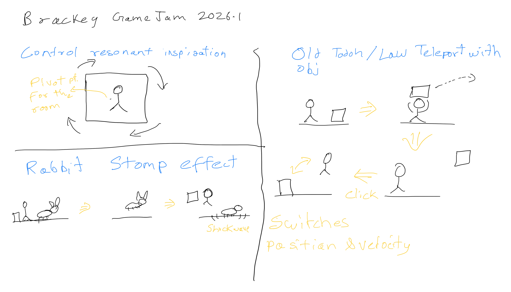

# Strange Places (To be named)

Submission for [Brackeys Game Jam 2026.1](https://itch.io/jam/brackeys-15) made in 7 days.

[Game link todo - Play on Itch.io](https://t3snake.itch.io/todo)

## Theme

`Strange Places`

## Engine

Godot 4.6 in Compatibility mode

Web Build Hosted

## Assets Used (CC0)

- [Mini Characters by Kenney](https://kenney.nl/assets/mini-characters-1)
- [Platformer kit by Kenney](https://kenney.nl/assets/platformer-kit)
- [Low-Poly Animal Pack by Quaternius](https://quaternius.itch.io/animated-easy-enemies)
- [Low-Poly Fish by Quaternius](https://quaternius.itch.io/lowpoly-animated-fish)
- [Tiny Swords (Only for UI) by Pixelfrog](https://pixelfrog-assets.itch.io/tiny-swords) (old version with CC0)
- [Charter font by Mathew Carter](https://practicaltypography.com/charter.html)
- [Sounds from Halftone by VOiD1](https://void1gaming.itch.io/halftone-sound-effects-pack-lite)
- [Footstep Sound from Impact Sounds by Kenney](https://kenney.nl/assets/impact-sounds)

### Not used anymore

## Idea

